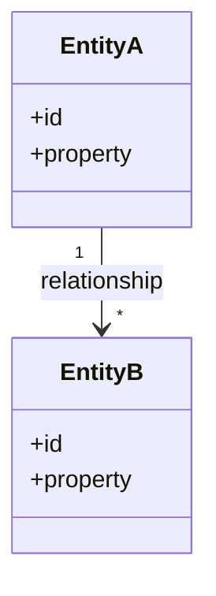
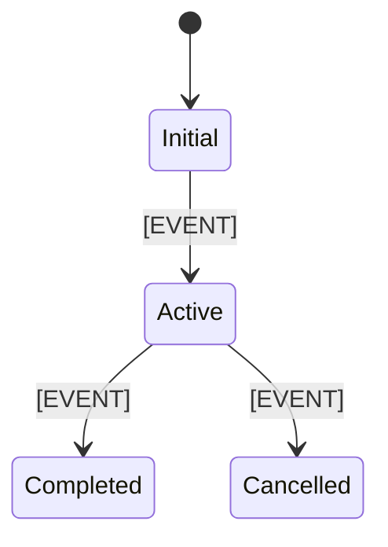

---

title: "[FEATURE NAME] Data Model"
feature: "[###-feature-name]"
type: "data-model"
version: "1.0" # 1.0 | 1.1 | 1.2
created: "[DATE]" # 2026-08-15T15:58:00+02:00
updated: "[DATE]" # 2026-08-15T15:58:00+02:00
status: "Draft" # Draft | In Review | Approved | Deprecated
spec: "./spec.md"
plan: "./plan.md"
research: "./research.md"
tags: [] # frontend, backend, api, ui, ux, data, security, performance, accessibility, testing, infrastructure, documentation, game, education, authentication, users, progression, planets, reporting, invoicing
dependencies: [] # ["###-feature-name", "###-feature-name"]
related_specs: [] # ["###-feature-name", "###-feature-name"]
------------------------------------------------------------

# Modelo de datos: [FEATURE NAME]

**Entrada**: `spec.md`, `plan.md`, `research.md` y contratos relevantes de `/specs/[###-feature-name]/`

**Propósito**: Definir el modelo conceptual de datos necesario para implementar la funcionalidad, incluyendo entidades, atributos, relaciones, invariantes, validaciones y transiciones de estado.

**Nota**: Este documento se genera durante la Fase 1 de `/speckit-plan`.

## Alcance del modelo

<!--
  Define qué parte del dominio cubre este documento.

  data-model.md DEBE describir el modelo conceptual necesario para la feature.

  DEBE incluir cuando aplique:
  - Entidades nuevas.
  - Entidades existentes modificadas.
  - Value Objects.
  - Relaciones.
  - Estados.
  - Invariantes.
  - Reglas de validación.
  - Ciclos de vida.
  - Requisitos de persistencia relevantes.
  - Impacto sobre datos existentes.

  NO debe:
  - Duplicar spec.md.
  - Diseñar endpoints.
  - Definir lógica de UI.
  - Incluir detalles de implementación innecesarios.
  - Convertirse automáticamente en un esquema físico de base de datos.
-->

[Describe the domain scope covered by this data model]

## Fuentes

<!--
  El modelo debe derivarse de las fuentes existentes.

  Prioridad recomendada:

  1. constitution.md
  2. spec.md
  3. plan.md
  4. research.md
  5. contracts/
  6. Modelo y código existentes

  No inventes entidades, atributos o relaciones sin una necesidad derivable
  de requisitos, decisiones técnicas o arquitectura existente.
-->

* **Constitución**: `../../.specify/memory/constitution.md`
* **Especificación**: `./spec.md`
* **Plan**: `./plan.md`
* **Investigación**: `./research.md`
* **Contratos**: `./contracts/`
* **Modelo existente**: [Relevant paths or N/A]

## Resumen del modelo

<!--
  Proporciona una visión rápida del modelo resultante.

  Incluye únicamente entidades y conceptos relevantes para esta feature.
-->

| ID     | Entidad / Concepto | Tipo                                       | Estado                      |
| ------ | ------------------ | ------------------------------------------ | --------------------------- |
| DM-001 | [ENTITY NAME]      | [Entity / Value Object / Enum / Aggregate] | [New / Modified / Existing] |
| DM-002 | [ENTITY NAME]      | [Entity / Value Object / Enum / Aggregate] | [New / Modified / Existing] |

## Diagrama conceptual

<!--
  OPCIONAL PERO RECOMENDADO cuando existan varias entidades o relaciones
  que se entiendan mejor visualmente.

  Utiliza Mermaid cuando sea suficiente.

  El diagrama debe representar conceptos de dominio y relaciones,
  no clases de framework ni tablas físicas salvo que sea necesario.

  Si no aporta valor, indica N/A.
-->

## Entidades

<!--
  Cada entidad debe tener un identificador estable DM-xxx.

  Para cada entidad documenta únicamente información relevante para el dominio
  y para la implementación de esta feature.

  Evita introducir:
  - ORM annotations
  - Decorators
  - Framework types
  - Database-specific syntax
  - Implementation details not required by the design
-->

### DM-001 — [ENTITY NAME]

**Tipo**: [Entity / Aggregate Root / Value Object / Enum]

**Estado**: [New / Modified / Existing]

**Descripción**: [What this entity represents]

**Responsabilidad**: [Primary responsibility in the domain]

### Atributos

| Atributo          | Tipo conceptual                                                            | Obligatorio | Descripción   |
| ----------------- | -------------------------------------------------------------------------- | ----------: | ------------- |
| `[attributeName]` | [string / integer / decimal / boolean / date / identifier / enum / object] |          Sí | [Description] |
| `[attributeName]` | [TYPE]                                                                     |          No | [Description] |

<!--
  Los tipos deben ser conceptuales.

  Ejemplo:
  - string
  - integer
  - decimal
  - boolean
  - date
  - datetime
  - identifier
  - enum
  - collection

  Evita tipos específicos como:
  - varchar(255)
  - bigint
  - Guid
  - DateTimeOffset
  - JSONB

  salvo que el detalle sea una restricción técnica explícita.
-->

### Identidad

**Identificador**: `[IDENTIFIER]`

**Regla de identidad**: [How uniqueness is determined]

<!--
  Si la entidad no tiene identidad propia, probablemente sea un Value Object.
-->

### Relaciones

* **[RELATIONSHIP]** → `[OTHER ENTITY]`: [Cardinality and meaning]
* **[RELATIONSHIP]** → `[OTHER ENTITY]`: [Cardinality and meaning]

### Reglas de validación

<!--
  Incluye validaciones derivadas de requisitos o invariantes del dominio.

  Ejemplos:
  - Valor obligatorio.
  - Rango permitido.
  - Formato.
  - Unicidad.
  - Dependencia entre campos.
-->

* **VAL-001**: `[attributeName]` MUST [validation rule].
* **VAL-002**: WHEN [condition], `[attributeName]` MUST [validation rule].

### Invariantes

<!--
  Una invariante es una condición que debe mantenerse siempre válida
  dentro del dominio.

  Ejemplos:
  - Una reserva no puede tener fecha de fin anterior a la fecha de inicio.
  - Un total no puede ser negativo.
  - Una entidad completada no puede volver a estado inicial.

  No confundas invariantes con simples validaciones de formulario.
-->

* **INV-001**: [Invariant]
* **INV-002**: [Invariant]

### Reglas de negocio asociadas

* **[FR-xxx]**: [Relevant business rule]
* **[FR-xxx]**: [Relevant business rule]

### Persistencia

<!--
  Describe únicamente las necesidades conceptuales de persistencia.

  Ejemplos:
  - Persistent
  - Ephemeral
  - Derived
  - Cached
  - Local only
  - Server-side

  El diseño físico debe documentarse solo si plan.md lo requiere.
-->

**Persistencia**: [Persistent / Ephemeral / Derived / Cached / N/A]

**Propiedad de los datos**: [System / User / External system / Derived]

**Retención**: [Retention requirement or N/A]

### Trazabilidad

* **Historias relacionadas**: [US1, US2 or N/A]
* **Requisitos relacionados**: [FR-001, FR-002 or N/A]
* **Decisiones relacionadas**: [R-001 or N/A]

---

### DM-002 — [ENTITY NAME]

**Tipo**: [Entity / Aggregate Root / Value Object / Enum]

**Estado**: [New / Modified / Existing]

**Descripción**: [What this entity represents]

**Responsabilidad**: [Primary responsibility in the domain]

### Atributos

| Atributo          | Tipo conceptual | Obligatorio | Descripción   |
| ----------------- | --------------- | ----------: | ------------- |
| `[attributeName]` | [TYPE]          |          Sí | [Description] |
| `[attributeName]` | [TYPE]          |          No | [Description] |

### Identidad

**Identificador**: `[IDENTIFIER]`

**Regla de identidad**: [How uniqueness is determined]

### Relaciones

* **[RELATIONSHIP]** → `[OTHER ENTITY]`: [Cardinality and meaning]

### Reglas de validación

* **VAL-003**: [Validation rule]

### Invariantes

* **INV-003**: [Invariant]

### Reglas de negocio asociadas

* **[FR-xxx]**: [Relevant business rule]

### Persistencia

**Persistencia**: [Persistent / Ephemeral / Derived / Cached / N/A]

**Propiedad de los datos**: [System / User / External system / Derived]

**Retención**: [Retention requirement or N/A]

### Trazabilidad

* **Historias relacionadas**: [USx or N/A]
* **Requisitos relacionados**: [FR-xxx or N/A]
* **Decisiones relacionadas**: [R-xxx or N/A]

---

[Añade más bloques `DM-xxx` cuando existan más entidades o conceptos relevantes]

## Value Objects

<!--
  Incluye esta sección cuando existan conceptos del dominio sin identidad propia.

  Un Value Object:
  - Se define por sus valores.
  - No necesita identidad independiente.
  - Preferiblemente es inmutable.
  - Puede encapsular validaciones o reglas de dominio.

  Si no existen Value Objects relevantes, indica N/A.
-->

### [VALUE OBJECT NAME]

**Descripción**: [What it represents]

**Atributos**:

| Atributo          | Tipo conceptual | Obligatorio |
| ----------------- | --------------- | ----------: |
| `[attributeName]` | [TYPE]          |          Sí |

**Reglas**:

* [Rule]
* [Rule]

## Enumeraciones y catálogos

<!--
  Define valores cerrados relevantes para el dominio.

  Evita inventar enums cuando el conjunto de valores pueda cambiar dinámicamente
  o pertenezca a configuración externa.
-->

### [ENUM NAME]

| Valor       | Significado |
| ----------- | ----------- |
| `[VALUE_1]` | [Meaning]   |
| `[VALUE_2]` | [Meaning]   |

## Relaciones

<!--
  Resume relaciones relevantes cuando existan suficientes entidades
  como para justificar una vista global.

  Si ya quedan completamente claras dentro de cada entidad,
  esta sección puede omitirse.
-->

| Origen      | Relación       | Destino     | Cardinalidad | Regla  |
| ----------- | -------------- | ----------- | ------------ | ------ |
| `[EntityA]` | [RELATIONSHIP] | `[EntityB]` | `1:N`        | [Rule] |
| `[EntityB]` | [RELATIONSHIP] | `[EntityC]` | `N:M`        | [Rule] |

## Agregados y límites de consistencia

<!--
  Incluir cuando el dominio utilice agregados o existan operaciones
  que deban mantener consistencia transaccional.

  Define:
  - Aggregate Root.
  - Entidades contenidas.
  - Invariantes protegidas por el agregado.
  - Qué referencias pueden cruzar el límite.

  Si no aplica, indica N/A.
-->

### [AGGREGATE NAME]

**Aggregate Root**: `[ENTITY]`

**Incluye**:

* `[ENTITY]`
* `[VALUE OBJECT]`

**Invariantes protegidas**:

* [Invariant]

**Límite de consistencia**: [Description]

## Estados y transiciones

<!--
  Incluir cuando una entidad tenga ciclo de vida o estados significativos.

  Cada transición debe indicar:
  - Estado origen.
  - Evento.
  - Estado destino.
  - Condiciones.
  - Reglas o efectos relevantes.

  No incluyas estados puramente visuales de UI.
-->

### [ENTITY NAME] State Machine

| Estado origen | Evento    | Estado destino | Condición   |
| ------------- | --------- | -------------- | ----------- |
| `[STATE]`     | `[EVENT]` | `[STATE]`      | [Condition] |

### Estados terminales

* `[STATE]`: [Meaning]
* `[STATE]`: [Meaning]

### Transiciones inválidas

* `[STATE]` → `[STATE]`: [Why this transition is not allowed]

## Reglas de integridad

<!--
  Define reglas que afectan a varias entidades o relaciones.

  Ejemplos:
  - Referential integrity.
  - Unique ownership.
  - Aggregate consistency.
  - Cross-entity constraints.
-->

* **INT-001**: [Integrity rule]
* **INT-002**: [Integrity rule]

## Datos derivados

<!--
  Documenta valores que pueden calcularse y no necesariamente deben persistirse.

  Esto ayuda a evitar duplicación innecesaria de datos.
-->

| Dato             | Derivado de       | Regla                            |
| ---------------- | ----------------- | -------------------------------- |
| `[derivedField]` | `[source fields]` | [Calculation or derivation rule] |

## Datos sensibles y privacidad

<!--
  Incluir únicamente cuando el modelo maneje información sensible,
  personal o regulada.

  Describe requisitos conceptuales, no soluciones criptográficas concretas
  salvo que estén exigidas por constitution.md o plan.md.
-->

* **Datos sensibles**: [Fields/entities or N/A]
* **Acceso**: [Who may access them]
* **Minimización**: [Relevant rule]
* **Retención**: [Relevant requirement]
* **Eliminación**: [Relevant requirement]

## Persistencia y almacenamiento

<!--
  Resume cómo encaja el modelo conceptual con la estrategia de persistencia
  definida en plan.md.

  Esta sección NO debe sustituir una migración ni un esquema de base de datos.

  Incluye únicamente:
  - Qué entidades se persisten.
  - Qué datos son temporales.
  - Qué datos vienen de sistemas externos.
  - Necesidades de migración.
-->

| Entidad    | Persistencia                       | Origen                     | Migración        |
| ---------- | ---------------------------------- | -------------------------- | ---------------- |
| `[ENTITY]` | [Persistent / Ephemeral / Derived] | [System / External / User] | [Required / N/A] |

## Migración de datos

<!--
  Incluir cuando esta feature modifique estructuras o datos existentes.

  Describe:
  - Estado actual.
  - Estado objetivo.
  - Compatibilidad.
  - Backfill necesario.
  - Riesgo de pérdida de datos.
  - Rollback conceptual.

  No incluyas scripts de migración completos aquí.
-->

**Requerida**: [Yes / No]

**Estado actual**: [Current data shape]

**Estado objetivo**: [Target data shape]

**Estrategia**: [Migration strategy]

**Backfill**: [Required / N/A]

**Compatibilidad**: [Backward/forward compatibility considerations]

**Rollback**: [Rollback approach or N/A]

## Concurrencia y consistencia

<!--
  Incluir cuando varias operaciones puedan modificar los mismos datos
  de forma concurrente o exista riesgo de inconsistencias.

  Ejemplos:
  - Optimistic concurrency.
  - Idempotency.
  - Duplicate submissions.
  - Ordering.
  - Conflict resolution.

  Si no aplica, indica N/A.
-->

* **Concurrency model**: [MODEL or N/A]
* **Conflict rule**: [RULE or N/A]
* **Idempotency requirements**: [RULE or N/A]

## Casos límite del modelo

<!--
  Deriva los casos relevantes de spec.md y de las invariantes identificadas.

  No repitas todos los edge cases funcionales; incluye únicamente
  los que afectan al modelo de datos.
-->

* [BOUNDARY CASE]
* [INVALID STATE]
* [MISSING RELATIONSHIP]
* [DUPLICATE DATA CASE]

## Impacto sobre contratos

<!--
  Identifica qué cambios del modelo afectan a contratos públicos o externos.

  Los detalles deben mantenerse en contracts/.
-->

* **[CONTRACT]**: [Data model impact]
* **[CONTRACT]**: [Data model impact]

Si no existe impacto:

`N/A — El modelo no introduce cambios en contratos externos o públicos.`

## Impacto sobre implementación

<!--
  Resume qué partes de plan.md y tasks.md deberán tener en cuenta
  este modelo.

  No generes aquí la lista de tareas.
-->

* [IMPLEMENTATION IMPACT]
* [IMPLEMENTATION IMPACT]

## Matriz de trazabilidad

<!--
  Incluye únicamente relaciones útiles entre modelo y especificación.

  No generes una matriz artificialmente completa si no aporta valor.
-->

| Elemento | Historias | Requisitos       | Decisiones |
| -------- | --------- | ---------------- | ---------- |
| `DM-001` | [US1]     | [FR-001, FR-002] | [R-001]    |
| `DM-002` | [US2]     | [FR-003]         | [R-002]    |

## Incertidumbres pendientes

<!--
  No debe quedar ninguna incertidumbre de modelo crítica antes de generar
  las tareas de implementación.

  Si una incertidumbre afecta materialmente al diseño, debe resolverse
  mediante research.md o marcarse como NEEDS CLARIFICATION.
-->

* [ ] [OPEN DATA MODEL QUESTION]

Si no existen:

`N/A — No existen incertidumbres de modelo bloqueantes.`

## Validación del modelo

<!--
  Antes de considerar data-model.md completado:

  - Todas las entidades necesarias están representadas.
  - Cada atributo relevante tiene un propósito.
  - Las relaciones son explícitas.
  - Las invariantes están documentadas.
  - Las transiciones de estado son válidas.
  - No existen datos duplicados sin justificación.
  - Los requisitos relevantes pueden mapearse al modelo.
  - El modelo respeta constitution.md y plan.md.
  - Los contratos afectados pueden derivarse de este diseño.
-->

* [ ] Todas las entidades necesarias están identificadas.
* [ ] No existen entidades sin una necesidad derivable.
* [ ] Los atributos relevantes están definidos.
* [ ] Las relaciones relevantes están documentadas.
* [ ] Las invariantes del dominio están identificadas.
* [ ] Las reglas de validación relevantes están definidas.
* [ ] Los estados y transiciones están documentados cuando aplican.
* [ ] Los datos derivados están identificados cuando aplica.
* [ ] Las necesidades de persistencia están definidas.
* [ ] Las migraciones necesarias están identificadas.
* [ ] Los requisitos relevantes tienen trazabilidad con el modelo.
* [ ] El modelo respeta `constitution.md`.
* [ ] El modelo es coherente con `plan.md` y `research.md`.
* [ ] No quedan `NEEDS CLARIFICATION` bloqueantes.

## Resultado

**Estado**: [RESULT] # Ready for contracts/tasks | Blocked

**Entidades nuevas**: [COUNT]

**Entidades modificadas**: [COUNT]

**Migraciones requeridas**: [COUNT]

**Incertidumbres bloqueantes**: [COUNT]

## Notas

* Los identificadores de elementos del modelo utilizan `DM-xxx`.
* Las validaciones utilizan `VAL-xxx`.
* Las invariantes utilizan `INV-xxx`.
* Las reglas de integridad utilizan `INT-xxx`.
* Los parámetros, identificadores, tipos técnicos, nombres de ficheros y rutas se mantienen en inglés.
* El contenido documental se redacta en castellano.
* El modelo debe representar conceptos del dominio antes que estructuras físicas de almacenamiento.
* No añadas entidades o campos por posibles necesidades futuras.
* No dupliques datos derivados salvo que exista una justificación concreta.
* Mantén el modelo tan simple como permitan los requisitos.
