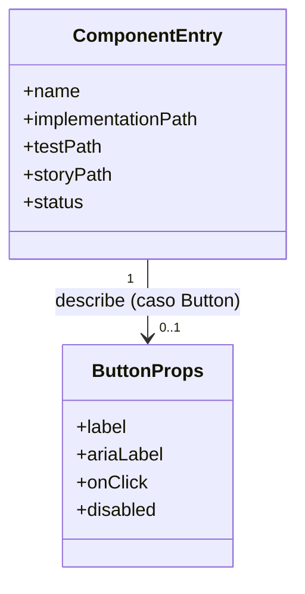

# Modelo de datos: Librería de componentes UI: arquitectura y componente Button

**Entrada**: `spec.md`, `plan.md`, `research.md` y contratos relevantes de `/specs/001-component-library-architecture/`

**Propósito**: Definir el modelo conceptual necesario para implementar la arquitectura de `libs/components/` y el componente `Button`: la forma de sus props públicas y la estructura mínima que debe cumplir cualquier componente para considerarse completo.

**Nota**: Este documento se genera durante la Fase 1 de `/speckit-plan`.

## Alcance del modelo

Esta funcionalidad no introduce datos persistentes ni entidades de dominio del juego. El modelo cubre dos conceptos puramente estructurales/de diseño de la librería:

* La forma de las propiedades públicas (`ButtonProps`) que acepta el componente `Button`.
* El conjunto mínimo de artefactos (`ComponentEntry`) que debe existir para que un componente de `libs/components/` se considere completo (FR-009) y no duplicado (FR-010).

No se diseñan tablas de base de datos, ORMs ni esquemas físicos: no aplica ninguna persistencia.

## Fuentes

* **Constitución**: `../../.specify/memory/constitution.md`
* **Especificación**: `./spec.md`
* **Plan**: `./plan.md`
* **Investigación**: `./research.md`
* **Contratos**: `./contracts/`
* **Modelo existente**: N/A — no existe código previo en el repositorio.

## Resumen del modelo

| ID     | Entidad / Concepto | Tipo          | Estado |
| ------ | ------------------- | ------------- | ------ |
| DM-001 | ButtonProps          | Value Object  | New    |
| DM-002 | ComponentEntry       | Value Object  | New    |

## Diagrama conceptual

## Entidades

### DM-001 — ButtonProps

**Tipo**: Value Object

**Estado**: New

**Descripción**: Representa las propiedades públicas de entrada del componente `Button`. No tiene identidad propia ni ciclo de vida: es la forma de los datos que recibe la función factory del componente.

**Responsabilidad**: Definir de forma explícita y mínima qué puede configurarse en una instancia de `Button`.

### Atributos

| Atributo    | Tipo conceptual | Obligatorio | Descripción                                                                                     |
| ----------- | ---------------- | ----------: | ------------------------------------------------------------------------------------------------- |
| `label`     | string            |          No | Texto visible del botón.                                                                          |
| `ariaLabel` | string            |          No | Etiqueta accesible alternativa, usada por tecnologías de asistencia cuando no hay `label` visible. |
| `onClick`   | identifier (callback) |     Sí | Acción a ejecutar cuando se activa el botón (clic, Enter/Espacio con foco).                        |
| `disabled`  | boolean           |          No (por defecto `false`) | Indica si el botón está deshabilitado.                                        |

### Identidad

**Identificador**: N/A — es un Value Object; no tiene identidad propia. Cada instancia de `Button` es independiente.

### Relaciones

* **Describe** → `ComponentEntry` (caso `Button`): `ButtonProps` es la forma pública concreta que documenta la entrada `Button` de `ComponentEntry`.

### Reglas de validación

* **VAL-001**: Al menos uno de `label` o `ariaLabel` MUST estar presente y no vacío (FR-011).
* **VAL-002**: WHEN `disabled` es `true`, el sistema MUST impedir que se invoque `onClick` (FR-007).

### Invariantes

* **INV-001**: Un `Button` no puede carecer simultáneamente de `label` visible y de `ariaLabel` (se deriva de VAL-001).

### Reglas de negocio asociadas

* **FR-005**: `Button` es el primer componente publicado en `libs/components/`.
* **FR-006**: `Button` soporta como mínimo estado habilitado y deshabilitado (`disabled`).
* **FR-007**: El estado deshabilitado bloquea la acción de `onClick`.
* **FR-011**: Etiqueta accesible alternativa cuando no hay `label` visible.

### Persistencia

**Persistencia**: N/A — no se persiste; `ButtonProps` existe únicamente en memoria mientras el componente está montado/renderizado.

**Propiedad de los datos**: Quien consume el componente (la feature que lo instancia) es responsable de proporcionar y mantener los valores de `ButtonProps`.

**Retención**: N/A.

### Trazabilidad

* **Historias relacionadas**: US1, US2, US3
* **Requisitos relacionados**: FR-005, FR-006, FR-007, FR-011
* **Decisiones relacionadas**: R-001

---

### DM-002 — ComponentEntry

**Tipo**: Value Object

**Estado**: New

**Descripción**: Representa, a nivel conceptual, la estructura mínima que debe tener cualquier componente publicado en `libs/components/` (incluido `Button`) para considerarse completo y disponible para el resto del proyecto. No es una entidad persistida en tiempo de ejecución: es un concepto estructural del repositorio (convención de carpetas/ficheros, ver R-004 en `research.md`).

**Responsabilidad**: Servir de checklist conceptual para verificar completitud (FR-009) y unicidad de nombre (FR-010) de un componente.

### Atributos

| Atributo             | Tipo conceptual | Obligatorio | Descripción                                                                 |
| -------------------- | ---------------- | ----------: | ---------------------------------------------------------------------------- |
| `name`               | string            |          Sí | Nombre único del componente dentro de `libs/components/` (p. ej. `button`). |
| `implementationPath` | identifier        |          Sí | Ruta a la implementación del componente.                                    |
| `testPath`           | identifier        |          Sí | Ruta a la suite de pruebas unitarias del componente.                        |
| `storyPath`          | identifier        |          Sí | Ruta a la historia de Storybook del componente.                            |
| `status`             | enum (`complete` / `incomplete`) | Sí | Derivado: `complete` únicamente si existen `testPath` y `storyPath`.        |

### Identidad

**Identificador**: `name`

**Regla de identidad**: `name` MUST ser único dentro de `libs/components/`; dos componentes no pueden compartir el mismo `name` (FR-010).

### Relaciones

* **Instancia concreta** → `ButtonProps`: el `ComponentEntry` con `name = "button"` documenta su API pública mediante `ButtonProps`.

### Reglas de validación

* **VAL-003**: `name` MUST ser único dentro de `libs/components/` (FR-010); un intento de reutilizar un `name` existente MUST bloquearse automáticamente (lint/CI).
* **VAL-004**: `status` MUST ser `complete` únicamente si existen tanto `testPath` como `storyPath` (FR-003, FR-004, FR-009).

### Invariantes

* **INV-002**: Un `ComponentEntry` con `status = "incomplete"` MUST NOT considerarse listo para su uso por el resto del proyecto (FR-009).

### Reglas de negocio asociadas

* **FR-001**: Todo componente reutilizable vive dentro de `libs/components/`.
* **FR-003**: Debe existir `testPath`.
* **FR-004**: Debe existir `storyPath`.
* **FR-009**: Sin `testPath`/`storyPath`, el componente es incompleto.
* **FR-010**: `name` único, verificado automáticamente.

### Persistencia

**Persistencia**: Estructural (convención de repositorio: carpetas y ficheros bajo control de versiones); no es un dato de runtime del juego.

**Propiedad de los datos**: Equipo de desarrollo del proyecto (repositorio de código).

**Retención**: N/A.

### Trazabilidad

* **Historias relacionadas**: US1, US2, US3
* **Requisitos relacionados**: FR-001, FR-003, FR-004, FR-009, FR-010
* **Decisiones relacionadas**: R-004, R-005
