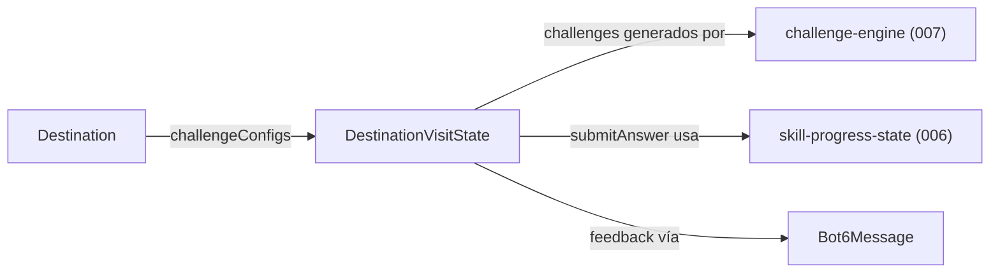
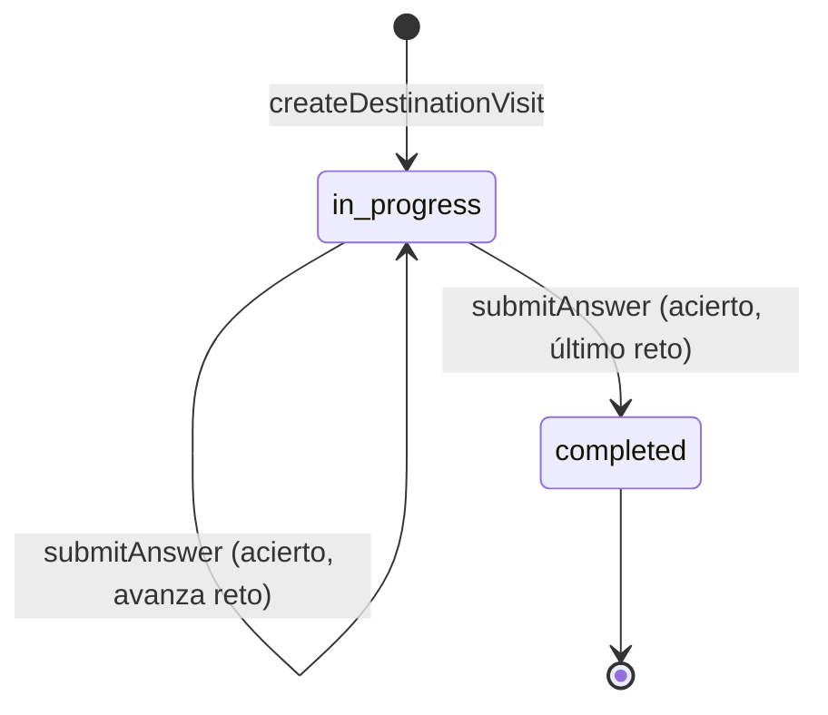

---

title: "Modelo de datos: Destino: la Luna con retos de conteo"
feature: "008-moon-destination-counting"
type: "data-model"
version: "1.0"
created: "2026-08-20"
updated: "2026-08-20"
status: "Draft"
spec: "./spec.md"
------------------------------------------------------------

# Modelo de datos (Fase 1)

## Entidades modificadas

### `Destination` (extendida)

Ubicación: `src/game/core/content/destinations.ts`.

```text
Destination
├── id: string                                              # sin cambios
├── name: string                                            # sin cambios
└── challengeConfigs?: readonly CountingChallengeConfig[]   # NUEVO, opcional
```

- `challengeConfigs` es opcional para no romper destinos futuros sin contenido
  todavía definido; solo el registro `'moon'` lo define en esta feature.
- Cada `CountingChallengeConfig` en el array NO incluye `difficulty` — ese campo
  se añade dinámicamente al generar cada reto, a partir del nivel de dominio
  "counting" vigente (ver `research.md` §1).
- Longitud del array = número de retos por visita (`3`, constante
  `CHALLENGE_SEQUENCE_LENGTH` en `destinations.constants.ts`).
- Migración futura (`021-expedition-mission-structure`): este campo es
  directamente reasignable a `Mission.challengeConfigs` sin cambiar su forma.

### `Bot6Message` (sin cambios de forma, nuevos registros)

Ubicación: `src/game/core/content/bot6-messages.constants.ts`. Se añaden nuevas
constantes `Bot6Message` (mismo tipo `{id, text}` ya existente), todas ≤
`BOT6_MESSAGE_MAX_LENGTH` (80 caracteres):

| Constante                              | Momento de uso                                   |
| --------------------------------------- | ------------------------------------------------- |
| `MOON_CHALLENGE_INTRO_MESSAGE`          | Al mostrar el primer reto de la secuencia          |
| `MOON_CHALLENGE_NEXT_MESSAGE`           | Al mostrar el 2º/3º reto tras un acierto           |
| `MOON_CHALLENGE_RETRY_MESSAGE`          | Tras una respuesta incorrecta (FR-004)             |
| `MOON_CHALLENGE_SUCCESS_MESSAGE`        | Tras una respuesta correcta, antes de avanzar      |
| `MOON_DESTINATION_COMPLETE_MESSAGE`     | Al completar el último reto de la secuencia (FR-003) |

Ninguno de estos mensajes contiene datos astronómicos reales ni interpola el
nombre del jugador (mismas restricciones ya vigentes de `005`).

### `SceneInitData` (extendida)

Ubicación: `src/game/core/navigation/navigation-state.type.ts`.

```text
SceneInitData
├── navigationState: NavigationState        # sin cambios
└── skillProgressState: SkillProgressState  # NUEVO, obligatorio
```

- `main.ts` lo inicializa una única vez con `createInitialSkillProgressState()`
  (`006`) al arrancar el juego.
- Cada escena lo guarda como campo público (mismo patrón ya usado para
  `navigationState`, necesario para que el listener de `popstate` de `main.ts`
  pueda reenviarlo) y lo reenvía en cada `scene.start(...)`, incluida la
  restauración por `popstate`.
- Vive solo durante la sesión del navegador; no se persiste entre recargas
  (fuera de alcance, `011`).

## Entidades nuevas

### `DestinationVisitState` (nueva, in-memory, no persistida)

Ubicación: `src/game/core/destination-visit/destination-visit-state.type.ts`.

```text
DestinationVisitState
├── destinationId: string                     # id del destino en curso
├── challenges: readonly Challenge[]          # secuencia ya generada (FR-014); longitud fija
├── currentIndex: number                      # posición 0-based dentro de `challenges`
├── status: 'in-progress' | 'completed'       # FR-003/FR-009
└── lastOutcome: SkillUpdateResult | null      # resultado del último intento, para feedback narrativo
```

- `challenges` se genera una única vez al crear la visita (`createDestinationVisit`),
  usando el nivel de habilidad de entrada — nunca se regenera a mitad de visita
  (FR-014, clarificación de spec.md).
- `currentIndex` solo avanza tras un acierto (`validateAnswer` = `'success'`);
  un fallo mantiene el mismo reto (reintento, FR-004/FR-006).
- `status` pasa a `'completed'` cuando `currentIndex` supera el último índice de
  `challenges` tras un acierto.
- No se persiste entre sesiones ni recargas de página (fuera de alcance, ver
  `011-save-progress-local`); vive solo en memoria de la escena activa.

## Relaciones



## Estados relevantes



## Persistencia

N/A — `DestinationVisitState` vive únicamente en memoria durante la visita activa
a `DestinationScene`; se descarta al volver al mapa (`beginTransitionToMap`) o al
recargar la página. No requiere migraciones.
